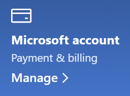

# Промяна на информацията за моя акаунт в MicrosoftChange my Microsoft account information

Отидете и [https://account.microsoft.com](https://account.microsoft.com/) влезте, ако е необходимо.Go to [https://account.microsoft.com](https://account.microsoft.com/) and sign in if necessary. Това ще ви отведе до таблото на вашия акаунт.This will take you to your account dashboard.  

**Редактиране на моето име и лична информация****Edit my name and personal information**

1. На таблото на вашия акаунт, до картината и името на акаунта щракнете върху **Още действия > Редактиране на профил**.On your account dashboard, next to your account picture and name, click **More actions > Edit profile**.
2. На страницата **Редактиране на профил** използвайте предоставените връзки, за да промените снимката на профила, името, датата на раждане, местоположението и предпочитанията за езика на показване.On the **Edit profile** page, use the links provided to change your profile picture, name, date of birth, location, and display language preference. Обърнете внимание на връзките към профилите на акаунта ви в Xbox или Skype, където можете да промените подробните данни, специфични за тези акаунти.Note the links to your Xbox or Skype account profiles, where you can change details specific to these accounts.

**Управление на имейл адреси и телефонни номера****Manage e-mail addresses and phone numbers**

Акаунтът в Microsoft има един или повече имейл адреси или телефонни номера, свързани с него като "псевдоними".A Microsoft account has one or more e-mail addresses or phone numbers associated with it as “aliases.” За да управлявате тези:To manage these:

1. На таблото на вашия акаунт, до картината и името на акаунта щракнете върху **Още действия > Редактиране на профил**.On your account dashboard, next to your account picture and name, click **More actions > Edit profile**.
2. На страницата **Редактиране на** профил щракнете върху Управление на начина на влизане **в Microsoft**.On the **Edit profile** page, click **Manage how you sign in to Microsoft**. 
3. Ще видите списък с псевдоними на акаунта и можете да управлявате списъка, включително добавяне и изтриване на имейл адреси и телефонни номера.You will see a list of account aliases, and you can manage the list, including adding and deleting e-mail addresses and phone numbers. Тук можете също да изберете кои псевдоними могат да се използват за влизане в акаунта и кой псевдоним се счита за "основен", който ще се показва на вашите устройства с Windows 10.Here you can also select which aliases can be used to sign in to the account, and which alias is considered “primary,” which will be displayed on your Windows 10 devices.

**Управление на методи на плащане, както и име и адрес за фактуриране****Manage payment methods, as well as name and address for billing** 

1. На таблото на вашия акаунт, до картината и името на акаунта щракнете върху **Още действия > Редактиране на профил**.On your account dashboard, next to your account picture and name, click **More actions > Edit profile**.
2. Под **Плащане & щракнете върху** **Управление**.Under **Payment & billing** click **Manage**.

    

3. Тук можете да добавяте, редактирате и премахвате методи на плащане и свързаните с тях адреси за фактуриране.Here you can add, edit, and remove payment methods and their associated billing addresses. 
