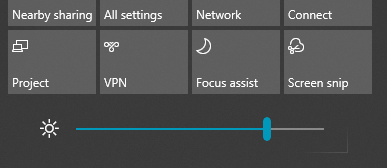

# Промяна на яркостта на екрана в Windows 10

Ако вашият Windows 10 по-нов от версия 1903, той има плъзгач **Яркост** в работния център. За да отворите работния център, щракнете върху бутона **Известие** от най-дясната страна на лентата на задачите или натиснете Windows начало **+ A** на клавиатурата.

Ако вашият Windows 10 е по-стара версия, можете да намерите плъзгача за яркост, **[като отворите Настройки > System > Display](ms-settings:display?activationSource=GetHelp)**.

**Бележки**:

- Може да не виждате плъзгача Промяна на яркостта за вградения плъзгач на настолни компютри, които имат външен монитор. За да промените яркостта на външен монитор, използвайте контролите на монитора.
- Ако нямате настолен компютър и плъзгачът не се показва или работи, опитайте да актуализирате драйвера на дисплея. В полето за търсене в лентата на задачите въведете **Диспечер на устройствата** и след това изберете Диспечер на **устройствата** от списъка с резултати. В **Диспечер на устройствата** изберете **Адаптери за показване**, след което изберете видеокартата. Натиснете и задръжте (или щракнете с десния бутон върху) името на видеокартата и щракнете върху **Актуализиране на драйвера**; след това следвайте инструкциите.
