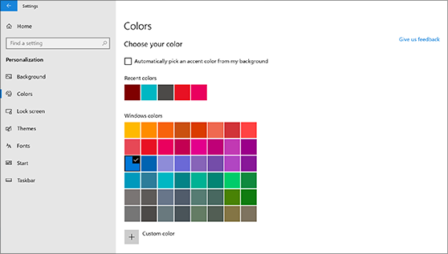
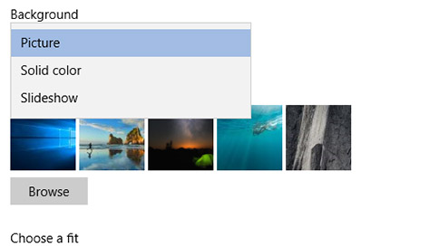

# Промяна на фона и цветовете на работния плот

За да промените настройката за цветове, отидете на Старт Настройки Персонализиране Цветове и след това изберете свой собствен  >    >    >  цвят или оставете Windows да изтеглите цветови оттенък от фона.

За да промените фона на работния плот, отидете на Старт Настройки "Персонализиране" и след това изберете картина, плътен цвят или  >    >    >  създайте слайдшоу с картини. 

Искате още фонове и цветове на работния плот? Посетете [Microsoft Store,](https://www.microsoft.com/store/collections/windowsthemes) за да изберете от десетки безплатни теми.
