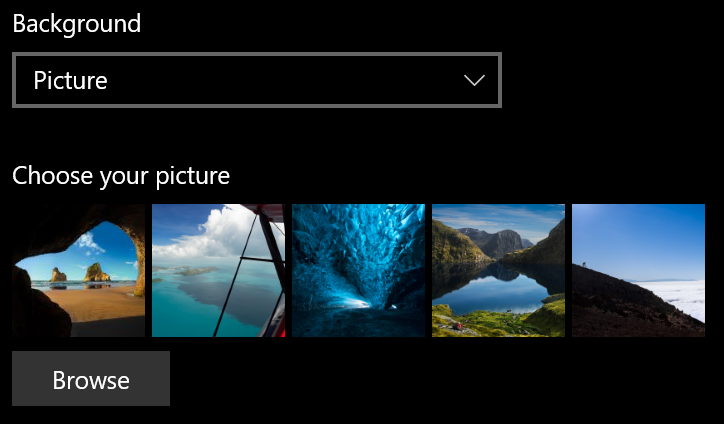
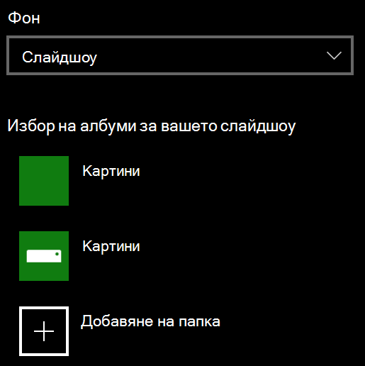

# Промяна на фона на заключения екранChange your lock screen background

- Отидете на **Настройки за** > **персонализиране** > **На заключен екран**.Go to **Settings** > **Personalization** > **Lock screen**. Или щракнете върху или докоснете [тук](ms-settings:lockscreen?activationSource=GetHelp).Or click or tap [here](ms-settings:lockscreen?activationSource=GetHelp).

- За да зададете фонова картина по избор, изберете **Картина** от падащия списък **"Фон"** и изберете или **Преглед** на картината.To set a custom background picture, select **Picture** from the **Background** drop-down list, and choose or **Browse** to the picture.

  

- За да настроите слайдшоу с персонализирани картини, изберете **Слайдшоу** от падащия списък **"Фон"** и изберете албум или добавете папка, която съдържа снимките за слайдшоуто.To set up a slideshow of custom pictures, select **Slideshow** from the **Background** drop-down list, and choose an album or add a folder that contains the pictures for the slideshow.

  
