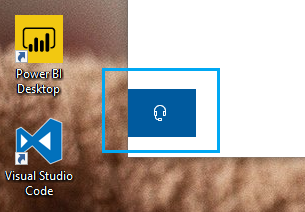

# Свържете се с нас, като щракнете върху бутона за слушалки

Ако искате да се свържете с поддръжката на Microsoft, щракнете **върху Свържете** се с нас в долния ляв ъгъл на това приложение. В прозореца за излитане ще бъдете напътствани към правилния канал за поддръжка, след като изберете своя продукт и категорията на проблема.

Можете да продължавате да взаимодействате с останалата част от приложението дори след като сте инициирали сесия на "Свържете се с нас". Панелът Свържете се с нас може временно да бъде намален, като щракнете някъде другаде в приложението. За да се върнете към същата сесия, просто щракнете **върху Свържете се с** нас отново.
