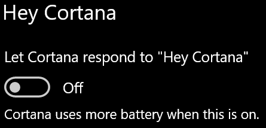

# Cortana не говори с мен или не ме чува

Ако се опитвате да използвате функцията "Хей Cortana", която ви позволява да говорите с Cortana, без да избирате бутона Cortana в лентата на задачите или бутона на микрофона в панела на Cortana, уверете се, че функцията е разрешена:

1. Отидете на **Старт**, след което **[изберете Настройки > Cortana](ms-settings:cortana?activationSource=GetHelp)**.
2. Под **Хей Cortana** превключете превключвателя Нека Cortana отговор на **"Хей Cortana"** на **Включване**.

**Вашите настройки за поверителност не позволяват Cortana ви чуват?**

Настройките за поверителност могат да попречат Cortana да реагират на гласа ви.
- Проверете дали функцията за онлайн разпознаване на говор е включена:
    - Отидете на **Старт**, след което щракнете **[върху Настройки > поверителност > Говор](ms-settings:privacy-speech?activationSource=GetHelp)**.
    - Под **Онлайн разпознаване на говор** превключете настройката на **Включване**.
- Проверете дали Cortana разрешение за достъп до вашия микрофон. 
    - Отидете на Старт, след което щракнете **[върху Настройки > поверителност > микрофона](ms-settings:privacy-microphone?activationSource=GetHelp)**.
    - Под **Изберете кои приложения** да имат достъп до вашия микрофон потърсете **Cortana** в списъка с приложения и услуги и се уверете, че превключвателят е превключван на **На**.

Освен това се уверете също, че високоговорителите или микрофоните ви са готови и работят, за да разговарят с Cortana.
