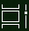

# Направете повече с многозадачането в Windows 10Do more with multitasking in Windows 10

За да видите или превключите  между приложения: можете да щракнете върху бутона Изглед на задача в лентата на задачите или да натиснете **Alt-Tab** на клавиатурата.To see or switch between apps: you can click the **Task View** button in the taskbar, or press **Alt-Tab** on your keyboard. Бутонът Изглед на задача изглежда така:The Task View button looks like this:

За лесно подреждане на две приложения една до друга, използвайте Помощ за прилепване: хванете горната част на прозореца на приложението и го плъзнете в едната страна, за да я "прилепите" до тази половина на екрана.To easily arrange two apps side by side, use Snap Assist: grab the top of an app window and drag it to one side to "snap" it to that half of the screen. След това изберете друго приложение и то автоматично ще се прилепи на място в другата половина на екрана.Then choose another app and it will automatically snap into place in the other half of the screen.

**За да създадете различни виртуални настолни компютри за дома и работата:****To create different virtual desktops for home and work**:

1. Щракнете върху **бутона Изглед на** задача в лентата на задачите или натиснете **Alt-Tab** на клавиатурата.Click the **Task View** button in the taskbar, or press **Alt-Tab** on your keyboard.
2. Щракнете **върху + Нов работен** плот (разположен в горния ляв ъгъл на екрана, докато сте в изглед на задача).Click **+ New Desktop** (located at the top left of your screen while in task view).
3. Отворете приложенията, които искате да използвате.Open the apps you want to use. 

Върнете се в **изгледа на задачите,** за да видите настолните си компютри и да превключвате между тях.Go back to **Task View** to see your desktops and switch between them.
