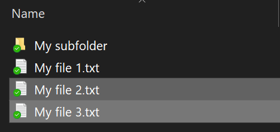
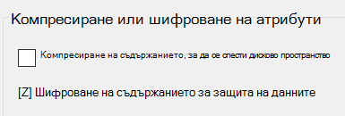

# Шифроване на файлове или папки в Windows 10Encrypt files or folder in Windows 10

Можете да шифровате цял диск с BitLocker, но за шифроване само на отделни файлове или папки (и тяхното съдържание):You can encrypt an entire disk using BitLocker, but to encrypt only individual files or folders (and their contents):

1. Във **Файловия мениджър**изберете файловете/папките, които искате да шифровате.In **File Explorer**, select the file(s)/folder(s) you want to encrypt. В този пример са избрани два файла:In this example, two files have been selected:

    

2. Щракнете с десния бутон върху избраните файлове и щракнете върху **Свойства**.Right-click the selected files and click **Properties**.

3. В прозореца **Свойства** щракнете върху **Разширени**.In the **Properties** window, click **Advanced**.

4. В прозореца **Разширени свойства** поставете отметка в квадратчето **Шифровай съдържанието за защита на данни:**In the **Advanced Properties** window, select the **Encrypt contents to secure data** checkbox:

    

5. Щракнете върху **OK**.Click **OK**.
