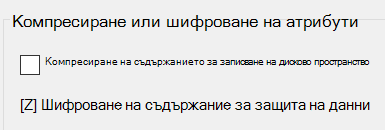

# Шифроване на файлове или папки в Windows 10

Можете да шифровате цял диск с помощта на BitLocker, но за да шифровате само отделни файлове или папки (и тяхното съдържание):

1. Във **File Explorer** изберете файловете/папките, които искате да копирате или шифровате. В този пример са избрани два файла:

    

2. Щракнете с десния бутон върху избраните файлове и щракнете върху **Свойства**.

3. В прозореца **Свойства** щракнете върху **Разширени**.

4. В прозореца **Разширени свойства** изберете квадратчето за отметка **Шифроване на съдържанието за защита на данните**:

    

5. Щракнете върху **OK**.
