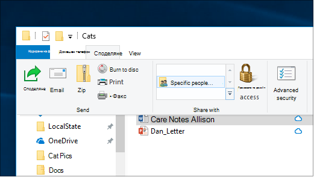
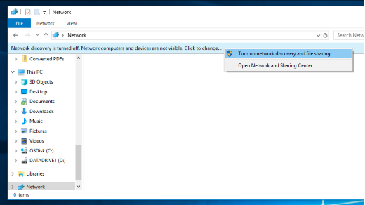

# Споделяне на файлове през мрежа в Windows 10

**Забележка**: Ако преди това сте използвали домашна група за споделяне на файлове, имайте предвид, че homegroup е премахната от Windows 10 (версия 1803). Сега можете да споделяте принтерите и файловете, като използвате вградени функции в Windows 10.

**За споделяне на файлове или папки в мрежа**

- Във **File Explorer**изберете файл, > щракнете върху раздела **споделяне** най-отгоре > в секцията **споделяне с** щракнете върху **определени хора**.

    
          
- Ако изберете няколко файла наведнъж, можете да ги споделите по един и същи начин. Тя работи и за папки.

**За да видите устройства в мрежата, които споделят файлове**

- Във **File Explorer**отидете на **мрежа**. Ако откриването на мрежата не е разрешена, ще видите съобщение за грешка "откриването на мрежата е изключено..."

- Щракнете върху **откриването на мрежата е изключен** банер, след което щракнете върху **включване на откриване на мрежа и споделяне на файлове**.

    

[Прочетете повече за споделянето на файлове през мрежа](https://support.microsoft.com/help/4092694/windows-10-file-sharing-over-a-network)

[Споделяне на файлове с помощта на приложения, OneDrive, имейли и др.](https://support.microsoft.com/help/4027674/windows-10-share-files-in-file-explorer)
