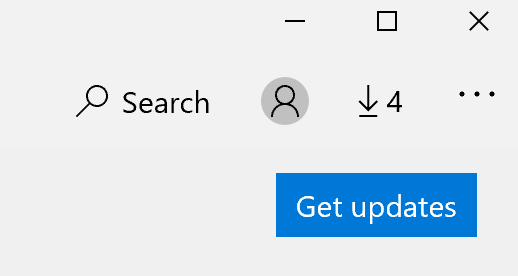

# Коригиране на езика на показване на приложенияFix the display language of apps

След като промените езика на показване в Windows 10, някои приложения все още могат да използват предишния език, когато ги отворите.After you change the display language in Windows 10, some apps may still use the previous language when you open them. Това се случва, защото нови версии на приложенията за този език трябва да бъдат изтеглени от магазина.This happens because new versions of the apps for that language must be downloaded from the Store. За да коригирате този проблем, можете или да изчакате за автоматичната актуализация, или можете ръчно да инсталирате актуализираната версия на приложенията.To fix this problem, you can either wait for the automatic update, or you can manually install the updated version of the apps.

За да инсталирате ръчно актуализацията, отворете **Microsoft Store** , след което щракнете върху " **изтегляния и актуализации** " в горния десен ъгъл.To manually install the update, open **Microsoft Store** and click **Downloads and updates** in the top right corner. След това щракнете върху **получаване на актуализации**.Then click **Get updates**. Ако езикът не се промени, след като приключи актуализацията, опитайте да рестартирате КОМПЮТЪРА си.If the language is not changed after the update is complete, try restarting your PC.

За да прочетете повече за настройките за език на въвеждане и показване, вижте [управление на вашите настройки за въвеждане и език на показване в Windows 10](https://support.microsoft.com/help/4027670/windows-10-add-and-switch-input-and-display-language-preferences).To read more about input and display language settings, see [Manage your input and display language settings in Windows 10](https://support.microsoft.com/help/4027670/windows-10-add-and-switch-input-and-display-language-preferences).
