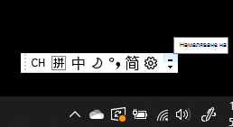
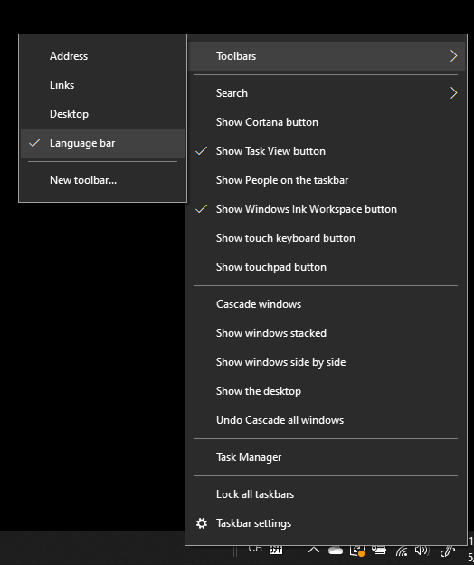
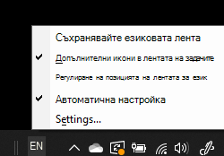

# Скриване, показване или възстановяване на състоянието на езиковата лентаHide, display, or reset the language bar

**За да намалите езиковата лента:****To minimize the language bar:**

Можете да щракнете върху бутона за намаляване в горния десен ъгъл на езиковата лента.You can click the minimize button on the top right corner of the language bar. Или можете просто да плъзнете езиковата лента в лентата на задачите, което автоматично ще я намали.Or, you can just drag the language bar to the task bar, which will automatically minimize it.

**За да извадите на екрана езиковата лента:****To pop out the language bar:**

Ако не искате да закачате езиковата лента в лентата на задачите, щракнете с десния бутон върху празно място в лентата на задачите и махнете отметката от опцията **Езикова лента** в менюто с ленти с инструменти.If you don't want to dock the language bar in the taskbar, right-click any empty space in the taskbar, and uncheck the **Language bar** option in the Toolbars menu. Това ще извади езиковата лента, която ще се показва извън лентата на задачите, точно както на предишната екранна снимка.This will make the language bar appear outside the taskbar, just like the previous screenshot.

**За да възстановите езиковата лента в състоянието по подразбиране:****To restore the language bar to default:**

Щракнете с десния бутон върху бутона за език в лентата с инструменти и щракнете върху опцията **Възстанови езиковата лента** в менюто.Right-click the language button in the toolbar, and click **Restore the language bar** option in the menu. Това ще я възстанови в състоянието по подразбиране.This will restore it to default.

