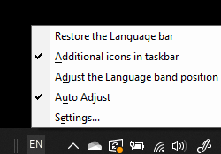

# Скриване, показване или възстановяване на състоянието на езиковата лента

**За да намалите езиковата лента:**

Можете да щракнете върху бутона за намаляване в горния десен ъгъл на езиковата лента. Или можете просто да плъзнете езиковата лента в лентата на задачите, което автоматично ще я намали.

**За да извадите на екрана езиковата лента:**

Ако не искате да закачате езиковата лента в лентата на задачите, щракнете с десния бутон върху празно място в лентата на задачите и махнете отметката от опцията **Езикова лента** в менюто с ленти с инструменти. Това ще извади езиковата лента, която ще се показва извън лентата на задачите, точно както на предишната екранна снимка.

**За да възстановите езиковата лента в състоянието по подразбиране:**

Щракнете с десния бутон върху бутона за език в лентата с инструменти и щракнете върху опцията **Възстанови езиковата лента** в менюто. Това ще я възстанови в състоянието по подразбиране.

