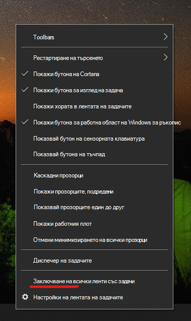

# Можете да местите лентата на задачите на една от двете страни или в горния край на работния плотMove the taskbar to either side or the top of your desktop

Първо, моля, потвърдете, че лентата на задачите е отключена.First, please confirm that the taskbar is unlocked. За да разберете дали вашият е отключен, щракнете с десния бутон върху празно място в лентата на задачите и вижте дали **заключването на лентата на задачите** е с отметка до нея.To find out whether yours is unlocked, right-click any empty space on the taskbar and see whether **Lock the taskbar** has a checkmark next to it. Ако има отметка, лентата на задачите е заключена и не може да бъде преместена.If there is a checkmark, the taskbar is locked and cannot be moved. Щракнете върху **Заключи лентата на задачите** , след като това ще го Отключи и премахнете отметката.Clicking **Lock the taskbar** once will unlock it and remove the checkmark.

Ако имате няколко монитора, които показват лентата на задачите, ще видите **заключване на всички ленти на задачите**.If you have multiple monitors that display the taskbar, you will see **Lock all taskbars**.

След като лентата на задачите е отключена, можете да натиснете и задържите всяко празно място в лентата на задачите и да го плъзнете до желаното местоположение на екрана.Once the taskbar is unlocked, you can press and hold any empty space on the taskbar and drag it to the location you want on the screen. Можете също да направите това, като щракнете с десния бутон върху произволно празно място на лентата на задачите и отидете на \*\* [Настройки на лентата](ms-settings:taskbar?activationSource=GetHelp) на задачите > на екрана\*\*.You can also do so by right-clicking on any empty space on the taskbar and go to **[Taskbar settings](ms-settings:taskbar?activationSource=GetHelp) > Taskbar location on screen**.
