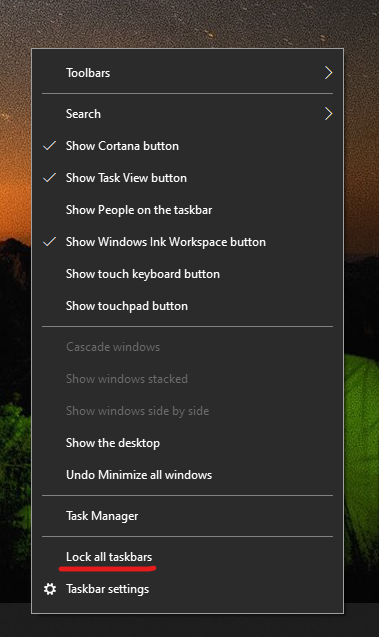

# Можете да местите лентата на задачите на една от двете страни или в горния край на работния плот

Първо, моля, потвърдете, че лентата на задачите е отключена. За да разберете дали вашият е отключен, щракнете с десния бутон върху празно място в лентата на задачите и вижте дали **заключването на лентата на задачите** е с отметка до нея. Ако има отметка, лентата на задачите е заключена и не може да бъде преместена. Щракнете върху **Заключи лентата на задачите** , след като това ще го Отключи и премахнете отметката.

Ако имате няколко монитора, които показват лентата на задачите, ще видите **заключване на всички ленти на задачите**.

След като лентата на задачите е отключена, можете да натиснете и задържите всяко празно място в лентата на задачите и да го плъзнете до желаното местоположение на екрана. Можете също да направите това, като щракнете с десния бутон върху произволно празно място на лентата на задачите и отидете на ** [Настройки на лентата](ms-settings:taskbar?activationSource=GetHelp) на задачите > на екрана**.
