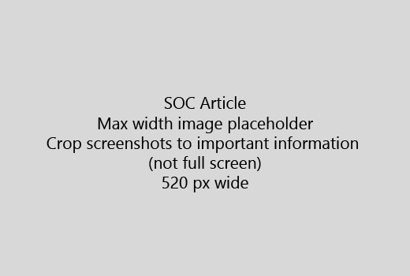

Започнете вашата статия с един много кратко въведение (1 изречение). Поставете се на мястото на читателя - защо те са тук? Какво да правя? 
  
1. Получите направо към бърз списък на стъпки за изпълнение на задачата.
    
    Ако трябва да обясни на концепция, или те трябва да направите предварително необходимите стъпки, добави бърз обобщение под стъпка, където те се нуждаят и [връзка](https://support.office.com/article/f37e7984-cf03-4fde-92d3-82970d7e241b.aspx) към концепцията или стъпки. 
    
2. Запази процедури кратко - за предпочитане 5 или по-малко стъпки, не повече от 8.
    
3. Използвайте **потребителския интерфейс стил** за елементи на потребителския интерфейс или текст, хората трябва да въведете. 
    
4. Използвайте глаголи изберете, изберете, или въведете като действия и форматиране на менюта като **менюто** \> **команда**.
    
5. Ако желаете добавете снимка за контекст (ако UI е трудно да намерите, или е необходимо за завършване на задачата).
    
    Максимална широчина: 520 пиксела. Използвайте Стандартна тема, не показват никаква лична информация и култура да се покаже само това, което е от значение. 
    
    
  
Ако искате да добавите видео или снимка, използвайте таблица с две колони и стъпките в ляво и видео или снимка в дясно - виж [стъпки и видео мрежата пример](https://support.office.com/article/14ce8e82-efa0-47f5-bb84-94f078db3dae.aspx). 
  
Целта не повече от 500 думи за една статия.
  
# Пример статия

[Промяна на моята снимка](https://support.office.com/article/555376e0-1fca-49ba-8434-307a0525c767.aspx)
  

