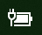

# Липсва икона на захранване или батерия в Windows 10Power or battery icon missing in Windows 10

Ако вашето устройство с Windows 10 има батерия (напр. лаптоп или таблет, или компютър, свързан чрез USB към UPS), обикновено иконата на захранването или батерията се показва в лентата на задачите близо до часовника, например:If your Windows 10 device has a battery (e.g., laptop or tablet, or a PC connected via USB to a UPS), normally a power/battery icon is shown in the taskbar near the clock, for example:

Ако не виждате тази икона, тя може да е скрита:If you don't see this icon, it may be hidden:

1. Отидете в **[Настройки > Персонализиране > лентата на задачите](ms-settings:taskbar?activationSource=GetHelp)**.Go to **[Settings > Personalization > Taskbar](ms-settings:taskbar?activationSource=GetHelp)**.

2. В областта за уведомяване щракнете върху **Избор кои икони да се показват в лентата на задачите**.In the Notification area, click **Select which icons appear on the taskbar**.

3. След това намерете **силата** в списъка и превключете настройката му **на Вкл**.Then find the **Power** item in the list and toggle its setting to **On**.

    

**Отстраняване на неизправности****Troubleshooting**

Ако сте изпълнили горните инструкции и превключвателят на **захранването** е сив или не се вижда, в полето за търсене в лентата на задачите въведете диспечера на **устройствата**и след това изберете Диспечер на **устройствата** в списъка с резултати.If you followed the above instructions and the **Power** toggle is greyed out or not visible, in the search box on the taskbar, type **device manager**, and then select **Device Manager** in the list of results. Под **Батерии**щракнете с десния бутон върху батерията на вашето устройство, щракнете върху **Деактивиране**и щракнете върху **Да**.Under **Batteries**, right-click the battery for your device, click **Disable**, and click **Yes**. Изчакайте няколко секунди, след което щракнете с десен бутон върху батерията и щракнете върху **Разрешаване**.Wait a few seconds, and then right-click the battery and click **Enable**. След това рестартирайте устройството си.Then restart your device.

Ако сте изпълнили горните инструкции, но иконата на батерията не се появява в лентата на задачите, в полето за търсене в лентата на задачите въведете **диспечера**на задачите и след това щракнете върху Диспечер на **задачите** в списъка с резултати.If you followed the above instructions, but the battery icon does not appear on the taskbar, in the search box on the taskbar, type **task manager**, and then click **Task Manager** in the list of results. В раздела **Процеси** под **име**щракнете с десния бутон **Explorer**, след което щракнете върху **Рестартиране**.On the **Processes** tab, under **Name**, right-click **Explorer**, and then click **Restart**.
