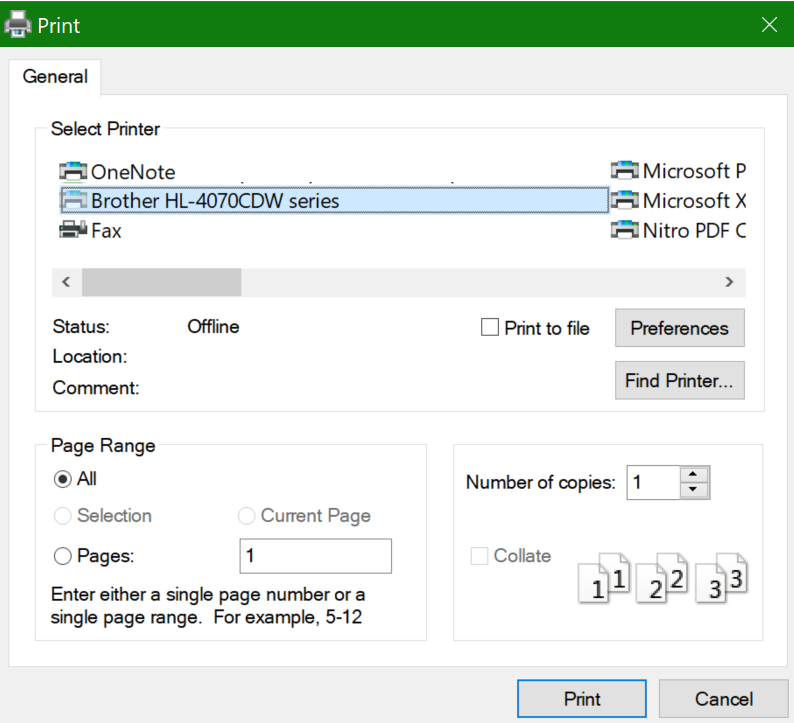

# Печат от двете страни на хартията (двустранен печат)Printing on both sides of paper (duplex printing)

**Моят принтер способен ли е на двустранен печат?****Is my printer capable of duplex printing?**

Резюмето или ръководството за функциите на принтера ви трябва да ви каже дали е в състояние да печата от двете страни на хартията, известно също като "двустранен печат".Your printer’s feature summary or manual should tell you whether it is capable of printing on both sides of the paper, also known as “duplex printing.” Ако имате Microsoft Office, друг начин да разберете е чрез отваряне на приложение на Office, като например Word или Excel, отиване на **Файл > Печат**, като се уверите, че е избран правилният принтер, и търсите възможността в секцията Настройки.If you have Microsoft Office, another way to find out is by opening an Office app like Word or Excel, going to **File > Print**, making sure the right printer is selected, and looking for the capability in the Settings section. Например:For example: 

**Двустранен печат в Microsoft Office****Duplex printing in Microsoft Office**

Ако принтерът ви може да печата и от двете страни, когато отидете на **Файл >** Печат в приложението Office, ще видите опция "Печат от двете страни", както е показано в примера по-горе.If your printer is capable of printing on both sides, when you go to **File > Print** in the Office app, you will see an option to “Print on Both Sides,” as shown in the example above.  Изберете типа двустранен печат, който искате (обърнете се на дългия ръб или обърнете късия ръб) и щракнете върху **Печат,** за да стартирате разпечатката.Select the type of duplex printing you want (flip on long edge, or flip on short edge), and click **Print** to start the printout.

**Двустранен печат от всяко приложение****Duplex printing from any application**

В много приложения, когато печатате, ще видите общ диалогов прозорец за печат, който изглежда така:In many apps when you print you will see a general print dialog that looks like this: 

Уверете се, че е избран правилният принтер, след което щракнете **върху Предпочитания, за** да отворите прозореца с предпочитания за принтера.Make sure the right printer is selected, then click **Preferences** to open the printer preferences window. Ако принтерът е в състояние на двустранен печат, възможността да разрешите това за текущото задание за печат ще се покаже в този прозорец.If the printer is capable of duplex printing, the ability to enable this for the current print job will show in that window.
