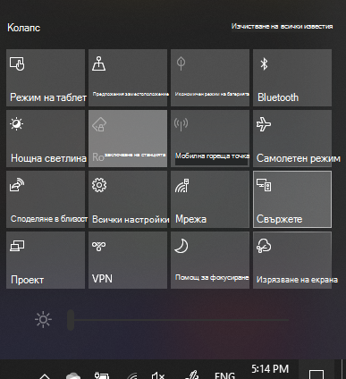

# Project to a PCProject to a PC

На вашето устройство местоназначение (прожектиране до) потърсете "Настройки на прожекцията", за да отворите страницата Настройки **на Прожектиране на този компютър.**On your destination device (projecting to), search for "Projection Settings" to open the Settings page of **Projecting to this PC**. След това се уверете, че:Then make sure that:
- Падащото меню "Някои устройства с Windows и Android могат да прожекти на този компютър, когато кажете, че е OK", е зададено на **Винаги изключено.**"Some Windows and Android devices can project to this PC when you say it's OK" drop-down menu is set to **Always Off**.
- Падащото меню "Помолете да прожектите на този компютър" е зададено на **Всеки път, когато е необходима връзка.**"Ask to project to this PC" drop-down menu is set to **Every time a connection is required**.
- Падащото меню "Изискване на ПИН за сдвояване" е зададено на **Никога.**"Require PIN for pairing" drop-down menu is set to **Never**.

На вашето устройство местоназначение стартирайте **приложението Свързване,** като отворите **"Старт"** и потърсете "Свързване".On your destination device, launch **Connect** app by going to **Start** and search for "Connect".

След това на вашето устройство източник, от което се опитвате да прожектите:Then, on your source device that you are trying to project from:

1. Натиснете **клавиша Windows + A, за** да отворите работния център.Press **Windows key + A** to open Action Center.
2. Щракнете **върху Свързване**.Click **Connect**.
3. Щракнете върху устройството, на което искате да прожектите екрана.Click the device you want to project the screen to.

След горните стъпки вашето устройство местоназначение трябва да показва екрана на устройството източник все едно е втори монитор.After the above steps, your destination device should display the screen of the source device as if it is a secondary monitor.
