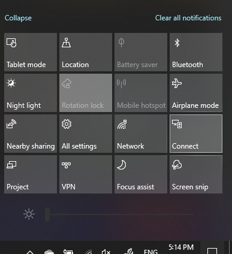

# Project към компютър

На вашето устройство местоназначение (прожектиране до) потърсете "Projection Настройки", за да отворите страницата Настройки **Projecting на този компютър**. След това се уверете, че:
- "Някои Windows устройства с Android могат да прожекти на този компютър, когато кажете, че е OK", падащото меню е зададено на **Винаги изкл.**
- Падащото меню "Помолете да прожектите на този компютър" е зададено на **Всеки път, когато е необходима връзка.**
- Падащото меню "Изискване на ПИН за сдвояване" е зададено на **Никога.**

На вашето устройство местоназначение **стартирайте Свързване,** като отворите **Старт** и потърсете "Свързване".

След това на вашето устройство източник, от което се опитвате да прожектите:

1. Натиснете **Windows + A, за** да отворите работния център.
2. Щракнете **върху Свързване**.
3. Щракнете върху устройството, на което искате да прожектите екрана.

След горните стъпки вашето устройство местоназначение трябва да показва екрана на устройството източник все едно е втори монитор.
