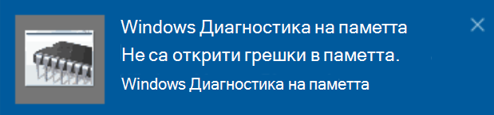

# Изпълнение Windows диагностика на паметта в Windows 10

Ако Windows приложения на компютъра ви се срива, замръзва или действа по нестабилен начин, може да имате проблем с паметта на компютъра (RAM). Можете да изпълните Windows диагностика на паметта, за да проверите за проблеми с RAM паметта на компютъра.

В полето за търсене в лентата на задачите въведете **диагностика на паметта** и след това изберете Windows Диагностика на **паметта**. 

За да изпълните диагностиката, компютърът трябва да се рестартира. Имате възможност да рестартирате незабавно (запишете работата си и затворете първо отворените документи и имейли) или планирайте диагностиката да се изпълнява автоматично при следващото рестартиране на компютъра:

Когато компютърът се рестартира, **инструментът Windows диагностика на паметта** ще се изпълнява автоматично. Състоянието и напредъкът ще се показват при изпълнение на диагностиката и имате възможност да отмените диагностиката, като натиснете **клавиша ESC** на клавиатурата.

Когато диагностиката завърши, Windows започне нормално.
Веднага след рестартирането, когато се появи работният плот, ще се появи известие (до иконата **на** работния център в лентата на задачите), за да се покаже дали са открити грешки в паметта. Например:

Ето иконата на работния център:  

И примерно известие: 

Ако сте пропуснали известието, можете да изберете иконата  **на работния** център в лентата на задачите, за да покажете работния център и да видите списък с известия, който може да се превърта.

За да прегледате подробна информация, **въведете събитие** в полето за търсене в лентата на задачите и след това изберете **Визуализатор на събития**. В левия **екран на** визуализатора на събития навигирайте до **Windows регистрационни файлове > система**. В десния екран сканирайте списъка, докато гледате  колоната Източник, докато не видите събития с стойност източник **MemoryDiagnostics-Results**. Маркирайте всяко такова събитие и вижте информацията за резултата в полето под **раздела Общи** под списъка.
