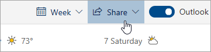

# Споделяне с Outlook в мрежата

1. В долната част на страницата изберете Календар, за да отидете в Календар.

2. В календара в лентата с инструменти в горната част на страницата изберете **Споделяне**и изберете календара, който искате да споделите. 

    

    **Забележка:** Не можете да споделяте календари, притежавани от други хора.

3. Въведете името или имейл адреса на човека, с когото искате да споделите календара си.

4. Изберете как искате да използвате календара ви: 
    - **Може да вижда, когато съм зает**   позволява им да виждат, когато сте заети, но не включва подробности като местоположението на събитието. 
    - **Може да преглежда заглавия и местоположения**   позволява им да виждат кога сте заети, както и заглавието и местоположението на събитията. 
    - **Може да преглежда всички детайли**   позволява им да виждат всички подробности за вашите събития. 
    - **Може да редактира**   позволява им да редактират календара ви. 
    - **Представител**   позволява им да редактират календара ви и да го споделят с други хора.

5. Изберете **Споделяне**. Ако решите да не споделяте календара си в момента, изберете **Премахване**. 

**Бележки**:  

- Когато споделяте календара си с някой, който не използва Outlook в мрежата, например някой, който използва Gmail, той ще може да приеме поканата само с помощта на Microsoft 365 или Outlook.com акаунт. 

- IcS календарите са само за четене, така че дори ако дадете достъп за редактиране на други хора, те няма да могат да редактират календара Ви. 

- Колко често се синхронизира вашият ICS календар зависи от доставчика на имейл на човека, с когото сте го споделили. 

- Елементите на календара, маркирани като поверителни, са защитени. Повечето хора, с които споделяте календара си, виждат само времето на елементите, маркирани като частни, а не заглавието, местоположението или други подробности. Повтарящите се серии, маркирани като частни, ще показват също така схемата на повторение.
