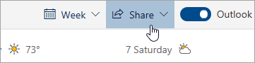

# Споделяне с Outlook в мрежата

От вашия календар в лентата с инструменти в горната част на страницата изберете **Споделяне**и изберете календара, който искате да споделите.

    

**Забележка:** Не можете да споделяте календари, притежавани от други хора.

- Въведете името или имейл адреса на лицето, с което искате да споделите календара си.
- Изберете как искате лицето да използва календара ви:
    - **Може да се разглежда, когато съм зает**   позволява им да виждат кога сте заети, но не включва подробности, като например местоположението на събитието.
    - **Може да преглежда заглавия и местоположения**   Позволява им да виждат кога сте заети, както и заглавието и местоположението на събитията.
    - **Може да видите всички детайли**   позволява им да видят всички подробности за събитията ви.
    - **Може да редактирате**   позволява им да редактират календара ви.
    - **Представител**   позволява им да редактират календара ви и да го споделят с други хора.
- Изберете **Споделяне**.
