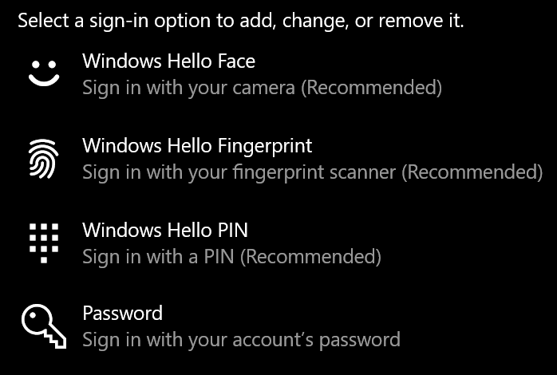
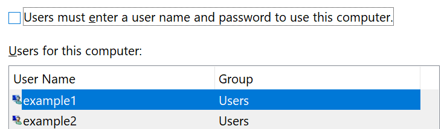

# Влизане в Windows 10 без използване на парола

За да избегнете въвеждане на парола при стартиране на Windows, ви препоръчваме да използвате една от опциите за защитено влизане в Windows Hello, като например ПИН код, разпознаване на лица или пръстов отпечатък, ако има такива. Ако наистина искате да забраните защитеното влизане, вижте инструкциите "Автоматично влизане в Windows 10" по-долу.

**Защитени алтернативи на Windows Hello на паролата за акаунта**

Отидете на **Настройки > акаунти > за влизане** (или щракнете [тук](ms-settings:signinoptions?activationSource=GetHelp)). Наличните опции за влизане ще бъдат изброени. Например:

Щракнете върху или докоснете една от опциите, за да я конфигурирате. Следващия път, когато стартирате или отключите Windows, ще можете да използвате новата опция вместо парола. 

**Автоматично влизане в Windows 10**

**Забележка:** Автоматичното влизане е удобно, но въвежда риск за защитата, особено ако компютърът ви е достъпен от няколко души. 

1. Щракнете върху или докоснете **бутона Старт** в лентата на задачите.

2. Въведете **netplwiz и** натиснете клавиша Enter, за да отворите прозореца Потребителски акаунти.

3. В **Потребителски акаунти** щракнете върху акаунта, в който искате да влезете автоматично, когато се стартира Windows.

4. Премахнете отметката от квадратчето "Потребителите трябва да въвеждат потребителско име и парола, за да използват този компютър".

    

5. Щракнете върху **OK**. Ще бъдете помолени да въведете и потвърдите паролата за акаунта, който сте избрали. Щракнете върху **OK,** за да завършите. Следващия път, когато Windows 10 се стартира, той автоматично ще влиза в акаунта, който сте избрали.
