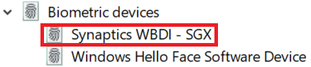

# Използвайте опцията за отключване на пръстови отпечатъци в Windows 10

**Разрешаване на пръстови отпечатъци на Windows**

За да отключите Windows 10 с помощта на вашия пръстов отпечатък, трябва да настроите Windows Hello Пръстови отпечатъци, като добавите (позволявайки на Windows да се научи да разпознава) поне един пръст. 

1. Отидете в **Настройки > акаунти > опции за влизане** (или щракнете [тук](ms-settings:signinoptions?activationSource=GetHelp)). Ще бъдат изброени наличните опции за влизане. Например:

    

2. Щракнете или докоснете **Windows Hello пръстови отпечатъци**, след което щракнете върху **Настройка**. В прозореца за инсталиране на Windows Hello щракнете върху **Първи стъпки**. Сензорът за пръстови отпечатъци ще се активира и ще бъдете помолени да поставите пръста си върху сензора:

   

3. Следвайте инструкциите, които ще ви помолят да сканирате пръста си многократно. Когато това приключи, ще имате възможност да добавите други пръсти, които може да искате да използвате за вход. Следващия път, когато влезете в Windows 10, ще имате възможност да използвате вашия пръстов отпечатък, за да го направите.

**Пръстовият отпечатък на Windows не е наличен като опция за влизане**

Ако Windows Hello Fingerprint не се показва като опция в **опциите за влизане,** това означава, че Windows не е наясно с четец/скенер за пръстови отпечатъци, прикрепени към вашия компютър, или че системна политика предотвратява използването му (ако например компютърът ви се управлява от работното ви място). За отстраняване на неизправности: 

1. Изберете бутона **Старт** в лентата на задачите и потърсете **Диспечер на устройствата**.

2. Щракнете върху или докоснете, за да отворите **диспечера на устройствата**.

3. В диспечера на устройствата разгънете Биометрични устройства, като кликнете върху неговата шевронна.

   

4. Скенерът ви за пръстови отпечатъци трябва да бъде посочен като биометрично устройство, като например синаптичния WBDI скенер:

   

5. Ако скенерът за пръстови отпечатъци не се показва и скенерът е интегриран в компютъра, отидете на уеб сайта на производителя на компютъра. В раздела за техническа поддръжка за вашия компютърен модел потърсете драйвер на Windows 10 за скенер, който можете да инсталирате.

6. Ако скенерът е отделен от компютъра (приложен чрез USB), отидете на уеб сайта на производителя на скенера, за да намерите и инсталирате софтуерза драйвер на устройство с Windows 10 за модела на скенера, който имате.
