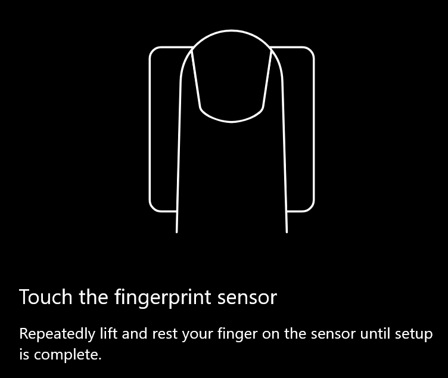

# Използвайте опцията за отключване на пръстови отпечатъци в Windows 10Use fingerprint unlock option in Windows 10

**Разрешаване на Windows Hello пръстови отпечатъци****Enable Windows Hello Fingerprint**

За да отключите Windows 10 с помощта на пръстови отпечатъци, трябва да настроите Windows Hello fingerprint чрез добавяне (оставяне на Windows да се научи да разпознава) поне един пръст.To unlock Windows 10 using your fingerprint, you need to set up Windows Hello Fingerprint by adding (letting Windows learn to recognize) at least one finger. 

1. Отидете на **настройки, за > акаунти > опции за влизане** (или щракнете [тук](ms-settings:signinoptions?activationSource=GetHelp)).Go to **Settings  > Accounts > Sign-in options** (or click [here](ms-settings:signinoptions?activationSource=GetHelp)). Ще бъдат показани наличните опции за влизане.Available sign-in options will be listed. Например:For example:

    

2. Щракнете върху или докоснете **Windows Hello пръстови отпечатъци**, след което щракнете върху **Настройка**.Click or tap **Windows Hello Fingerprint**, then click **Set up**. В прозореца на инсталиращата програма на Windows Hello щракнете върху **Първи стъпки**.In the Windows Hello setup window, click **Get started**. Сензорът за пръстови отпечатъци ще бъде активиран и ще бъдете помолени да поставите пръст върху сензора:The fingerprint sensor will activate, and you'll be asked to place your finger on the sensor:

   

3. Следвайте инструкциите, които ще ви накарат да сканирате многократно пръста си.Follow the instructions, which will ask you to repeatedly scan your finger. Когато това приключи, ще имате възможност да добавите други пръсти, които може да поискате да използвате за влизане.When this is finished, you'll have the option of adding other fingers you may want to use for sign-in. Следващия път, когато влезете в Windows 10, ще имате възможност да използвате пръстови отпечатъци, за да го направите.Next time you sign in to Windows 10, you will have the option of using your fingerprint to do so.

**"Windows Hello пръстови отпечатъци" не е наличен като опция за влизане****Windows Hello Fingerprint not available as a sign-in option**

Ако "Windows Hello fingerprint" не се показва като опция в " **Опции за влизане**", това означава, че Windows не е наясно с четеца/скенера за пръстови отпечатъци, прикачени към компютъра или че правилата на системата предотвратяват употребата му (ако НАПРИМЕР вашият компютър се управлява от работното ви място).If Windows Hello Fingerprint is not shown as an option in **Sign-in options**, it means Windows is not aware of any fingerprint reader/scanner attached to your PC, or that a system policy prevents its use (if for example your PC is managed by your workplace). За отстраняване на неизправности:To troubleshoot: 

1. Изберете бутона " **Старт** " в лентата на задачите и потърсете **Диспечер на устройствата**.Select the **Start** button in the Taskbar and search for **Device Manager**.

2. Щракнете върху или докоснете, за да отворите **диспечера на устройствата**.Click or tap to open **Device Manager**.

3. В диспечера на устройствата разгънете биометрични устройства чрез щракване върху нейната Шеврон.In Device Manager, expand Biometric devices by clicking its chevron.

   

4. Скенерът на пръстови отпечатъци трябва да бъде показан като биометрична устройство, като например Synaptics WBDI Scanner:Your fingerprint scanner should be listed as a biometric device, such as the Synaptics WBDI scanner:

   

5. Ако скенерът ви за пръстови отпечатъци не е показан и скенерът е вграден в КОМПЮТЪРА ви, отидете на уеб сайта на производителя на КОМПЮТЪРА.If your fingerprint scanner is not shown, and the scanner is integrated into your PC, go to the PC manufacturer's website. В секцията техническа поддръжка за модела на КОМПЮТЪРА Потърсете драйвер за Windows 10 за скенер, който можете да инсталирате.In the technical support section for your PC model, search for a Windows 10 driver for a scanner that you can install.

6. Ако скенерът е отделен от КОМПЮТЪРА (прикачен чрез USB), отидете на уеб сайта на производителя на скенера, за да намерите и инсталирате софтуера на драйвера за устройство с Windows 10 за модела на скенера, който имате.If the scanner is separate from the PC (attached via USB), go to the scanner manufacturer's website to find and install Windows 10 device driver software for the scanner model you have.
