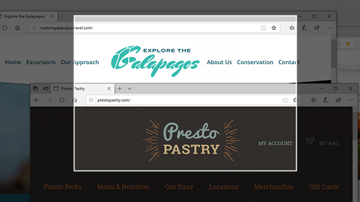
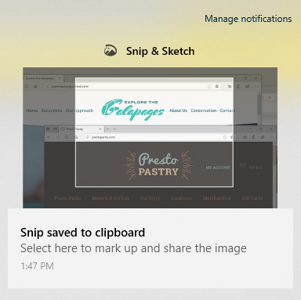

# Използвайте "изрезка & скица", за да заснемете, маркирате и споделите изображения

Скицата на екрана сега се нарича **изрезка & скица**. **За да направите бързо изрезка**:

1. Натиснете **клавиша с емблемата на Windows + SHIFT + S**. Ще виждате екрана мрачни и курсорът ви да се показва като кръстче. 

2. Изберете точка в края на областта, която искате да копирате, и щракнете върху курсора. 

3. Приближете курсора, за да осветите областта, която искате да заснемете. В екрана ще се показва областта, която заснемате.

   

Изображението, което сте изрязвали, се записва в клипборда ви, готов за поставяне в имейл или документ. 

**Ако искате да редактирате или видите изображението**: 

- Щракнете върху иконата за уведомления най-вдясно в лентата на задачите. след това щракнете върху картината, която току-що сте заснели. Изрезката се отваря в приложението "изрезка & скица".

   
