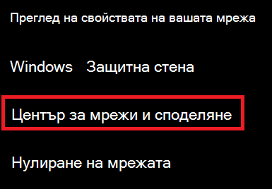
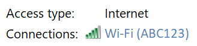
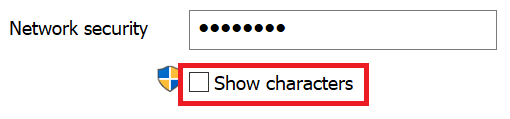

# Преглед на паролата за Wi-Fi мрежа в Windows 10View Wi-Fi network password in Windows 10

1. Уверете се, че вашият компютър с Windows 10 е свързан към Wi-Fi мрежата.Make sure your Windows 10 PC is connected to the Wi-Fi network.

2. Отидете в **Настройки > & Интернет > Състояние**, или щракнете тук, за да ни позволите да ви отведем там сега.) Go to **Settings  > Network & Internet  > Status**, or click or tap [here](ms-settings:network?activationSource=GetHelp) to let us take you there now.)

3. Щракнете върху **Център за мрежи и споделяне**.Click **Network and Sharing Center**.

    

4. В **Центъра за мрежи и споделяне**, до **Връзки**ще видите името на вашата безжична мрежа.In **Network and Sharing Center**, next to **Connections**, you will see the name of your wireless network. Например, ако вашата мрежа е наречена "ABC123", може да видите:For example, if your network is named "ABC123," you might see:

    

    Щракнете върху името на безжичната мрежа, за да отворите прозореца на Wi-Fi статуса.Click the wireless network name to open the Wi-Fi Status window. 

5. В прозореца на Wi-Fi състояние щракнете върху **Безжични свойства**, щракнете върху раздела **Защита** и проверете Показване **на знаци**.In the Wi-Fi Status window, click **Wireless Properties**, click the **Security** tab, and check **Show characters**.

    

