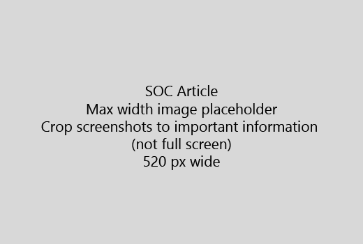

Започнете вашата статия с един много кратко въведение (1 изречение). Поставете се на мястото на читателя - защо те са тук? Какво да правя?Start your article with a very short introduction (1 sentence). Put yourself in the reader's place - why are they here? What should they do? 
  
1. Получите направо към бърз списък на стъпки за изпълнение на задачата.Get straight to a quick list of steps to accomplish the task.
    
    Ако трябва да обясни на концепция, или те трябва да направите предварително необходимите стъпки, добави бърз обобщение под стъпка, където те се нуждаят и [връзка](https://support.office.com/article/f37e7984-cf03-4fde-92d3-82970d7e241b.aspx) към концепцията или стъпки.If you need to explain a concept, or they have to do pre-requisite steps, add a quick summary below the step where they need it, and [link](https://support.office.com/article/f37e7984-cf03-4fde-92d3-82970d7e241b.aspx) to the concept or steps. 
    
2. Запази процедури кратко - за предпочитане 5 или по-малко стъпки, не повече от 8.Keep procedures short - preferably 5 or fewer steps, no more than 8.
    
3. Използвайте **потребителския интерфейс стил** за елементи на потребителския интерфейс или текст, хората трябва да въведете.Use **Ui style** for user interface elements or for text people need to enter. 
    
4. Използвайте глаголи изберете, изберете, или въведете като действия и форматиране на менюта като **менюто** \> **команда**.Use the verbs choose, select, or enter as actions, and format menus as **Menu** \> **Command**.
    
5. Ако желаете добавете снимка за контекст (ако UI е трудно да намерите, или е необходимо за завършване на задачата).Optionally, add a screenshot for context (if UI is hard to locate, or it's needed to complete the task).
    
    Максимална широчина: 520 пиксела. Използвайте Стандартна тема, не показват никаква лична информация и култура да се покаже само това, което е от значение.Maximum width: 520 pixels. Use a standard theme, do not show any personal information, and crop to show only what's relevant. 
    
    
  
Ако искате да добавите видео или снимка, използвайте таблица с две колони и стъпките в ляво и видео или снимка в дясно - виж [стъпки и видео мрежата пример](https://support.office.com/article/14ce8e82-efa0-47f5-bb84-94f078db3dae.aspx).If you want to add a video or screenshot, use a two-column grid and have the steps in the left and the video or screenshot in the right - see [Steps and video grid example](https://support.office.com/article/14ce8e82-efa0-47f5-bb84-94f078db3dae.aspx). 
  
Целта не повече от 500 думи за една статия.Target no more than 500 words for an article.
  
# Пример статияExample article

[Промяна на моята снимкаChange my photo](https://support.office.com/article/555376e0-1fca-49ba-8434-307a0525c767.aspx)
  

